# PicoAide Harness 客户端使用教程

本文只介绍桌面客户端，不包含服务端管理后台。截图取自官方中性客户端 `v2.8.2-beta.3`，使用演示账号与模拟数据拍摄；实际品牌、可用功能、模型和数据以你登录的单位环境为准。红框与编号对应图片底部图例。

## 1. 连接与登录

首次打开客户端，先输入单位提供的服务端地址，再按服务端启用的登录方式输入账号。不要把管理员后台地址误填为客户端服务端地址；不确定地址时向本单位管理员确认。

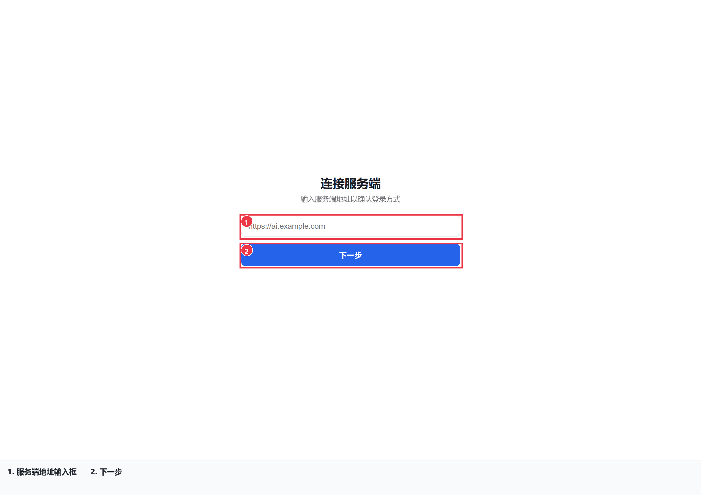

1. 在 **① 服务端地址输入框** 填入单位提供的完整地址，例如 `https://ai.example.com`。
2. 点 **② 下一步**。客户端会读取该服务端支持的登录方式。

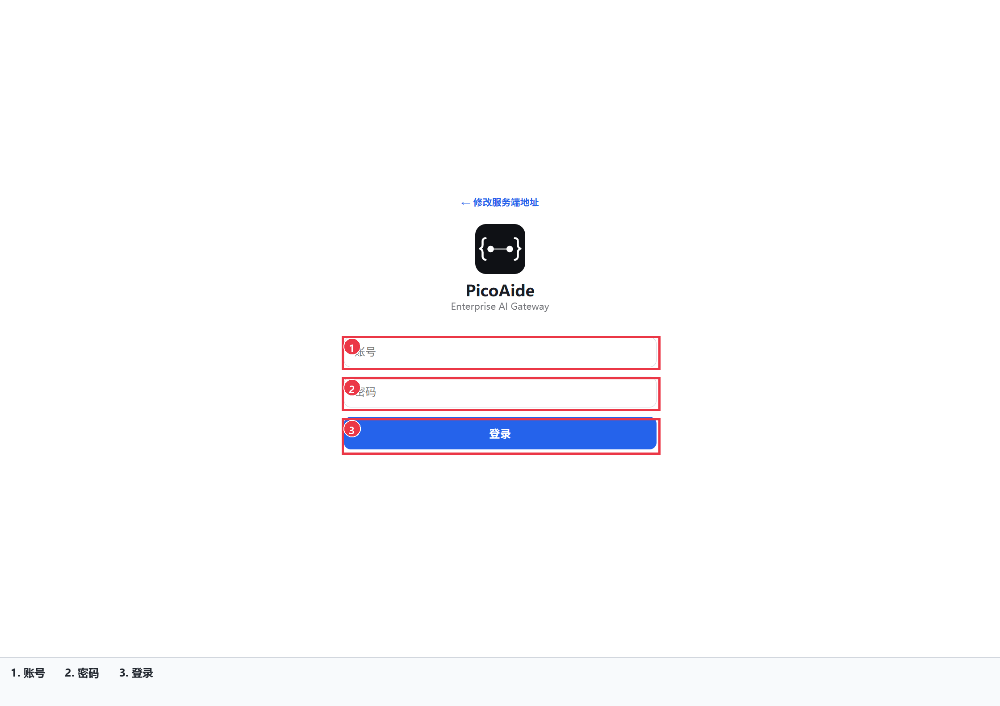

1. 在 **① 账号** 和 **② 密码** 中输入分配给你的凭据。
2. 点 **③ 登录**。若页面提供其他登录方式，按本单位要求选择。
3. 要更换服务端，点页面上方的“修改服务端地址”。

## 2. 认识主界面

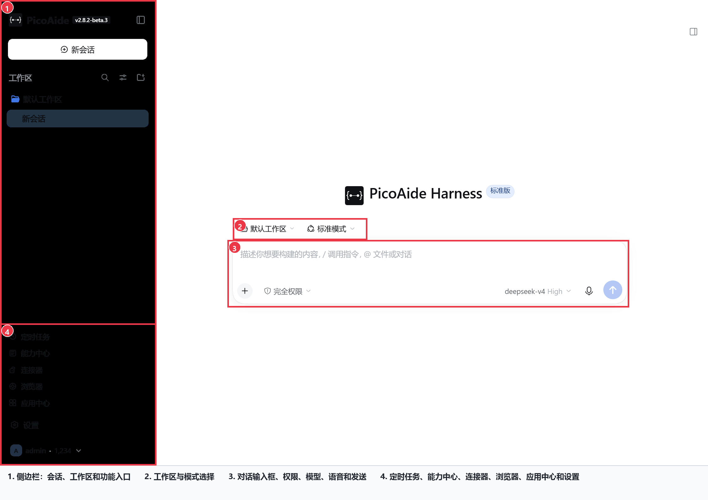

- **① 侧边栏**：上方“新会话”开始新的聊天；工作区下列出已有会话，点会话可继续。工作区标题旁的搜索、筛选和添加图标用于定位或添加工作区内容。
- **② 工作区与模式**：为当前会话选择工作目录和 Agent 预设。需要让助手读取或修改项目文件时，先选对工作区。
- **③ 对话输入区**：写需求、选择权限与模型，也可使用附件和语音。右下角箭头发送。
- **④ 功能入口**：定时任务、能力中心、连接器、浏览器、应用中心和设置均从侧边栏进入。点功能页面顶部的“返回聊天”回到会话。

### 工作区与新会话

工作区决定本次会话访问文件的范围。开始项目任务前，点输入框上方的工作区名称，选择已有目录或添加目录；再点左上角“新会话”。聊天记录会保留在相应工作区下。不要在含敏感文件的目录中授予超出任务所需的权限。

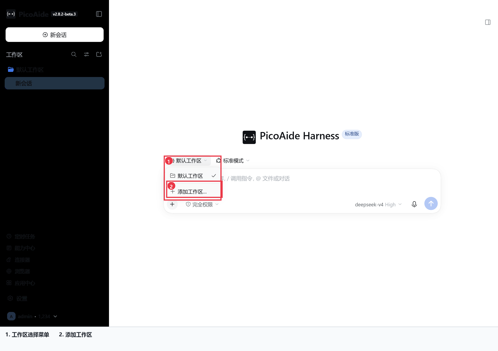

- **① 工作区菜单**：当前目录带勾选标记，点其他目录即可切换。
- **② 添加工作区**：选择本机文件夹后，该目录会出现在工作区列表中。

### 搜索与管理会话

左侧工作区标题旁的放大镜用于搜索会话；旁边的筛选图标用于缩小列表范围。点会话标题打开历史对话，点“新会话”开始独立的新任务。会话中途切换工作区前，先确认当前任务不再依赖原目录。

## 3. 对话与输入工具

在输入框描述目标、背景和交付要求。可用 `/` 调用命令，用 `@` 引用文件或对话；这些提示会随输入内容出现。选择模型和权限后点发送，等待助手返回结果。需要补充要求时继续在同一会话输入。

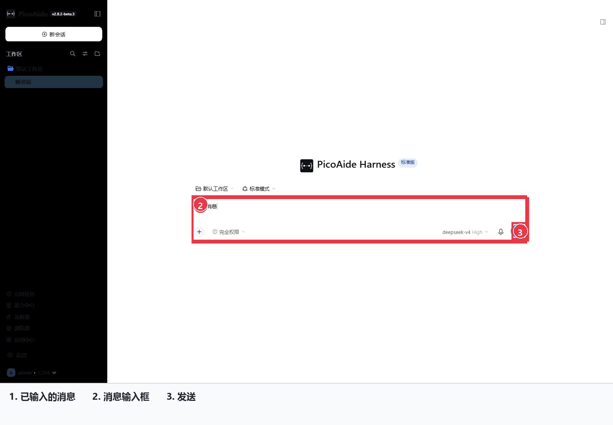

- **① 输入区**：输入任务描述；较复杂的任务建议写清需要处理的文件和验收标准。
- **② 附件按钮 `+`**：添加可供本次会话参考的内容。左下角权限菜单控制工具可执行的范围。
- **③ 模型菜单**：选择可用模型；列表由当前服务端配置决定。
- **④ 麦克风**：将语音转成输入文字，发送前可继续编辑。
- **⑤ 发送箭头**：提交消息。发送前检查工作区、权限和模型是否正确。

> 图中的“完全权限”是演示会话状态。日常使用应按任务选择合适的权限；涉及文件修改或命令执行时，留意客户端的确认提示。

### 右侧栏与会话工具

在会话右上角点侧栏图标可展开右侧栏。它集中放置工作区文件、新建终端和定时任务快捷入口，适合一边聊天一边查看相关内容。

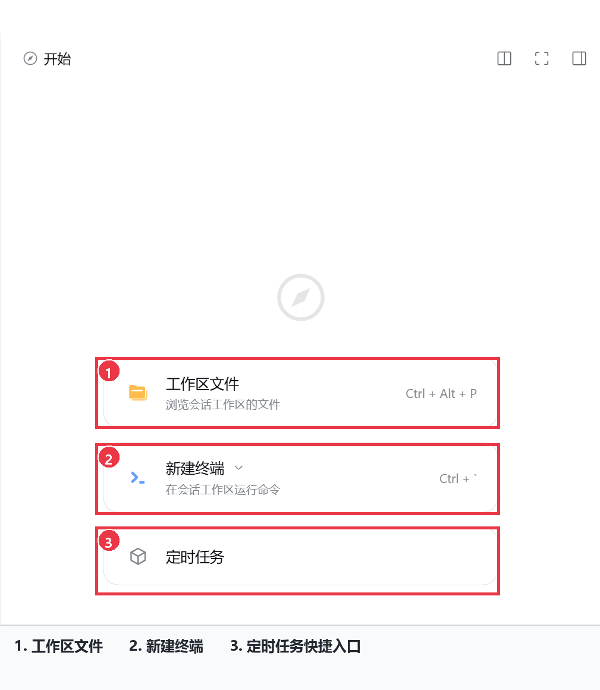

- **① 工作区文件**：浏览当前会话关联的文件。
- **② 新建终端**：尝试在会话工作区打开命令行。当前 Windows 演示环境只验证到入口可点击，终端内容没有成功渲染；遇到空白时请使用系统终端完成命令操作。
- **③ 定时任务**：快速进入定时任务相关入口。

## 4. 定时任务

定时任务可按设定时间执行 Agent 指令，适合周期报告、定期检查等任务。点侧边栏“定时任务”进入中心；图中的五张卡片是模拟数据，均处于停用状态。

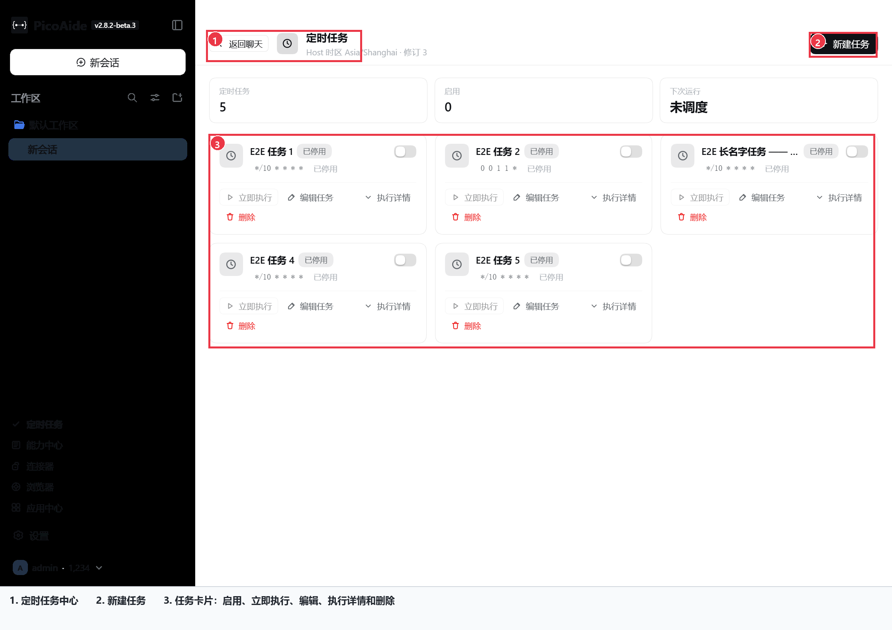

1. 点 **② 新建任务**，填写名称、执行时间和要交给 Agent 的指令，确认后保存。
2. 在 **③ 任务卡片** 使用开关启用或停用任务；需要试跑时点“立即执行”。
3. 点“编辑任务”修改计划，点“执行详情”查看历史结果；删除前确认不再需要此任务。
4. 点 **① 返回聊天** 离开任务中心。

任务按页面显示的 Host 时区运行。首次启用前，检查指令涉及的工作区和执行权限，并用“立即执行”验证结果。

## 5. 能力中心

能力中心管理可在对话中使用的技能和智能体。点侧边栏“能力中心”，先在“我的”查看已安装项目；需要新增时切换到“市场”。

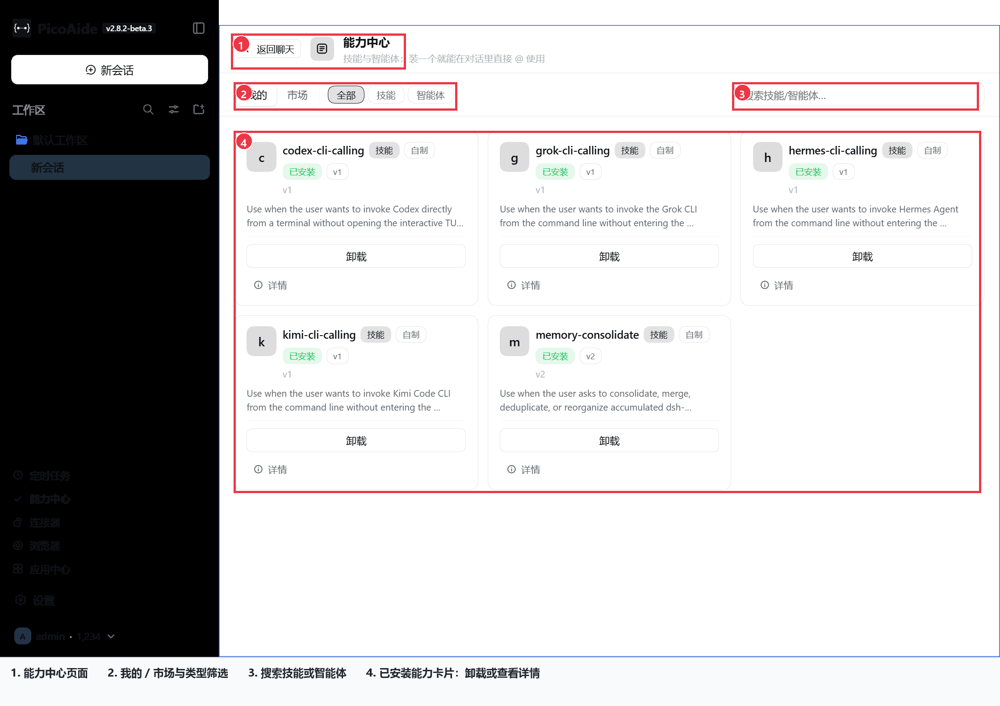

- **① 页面标题与返回聊天**：确认当前位于能力中心，完成后返回会话。
- **② “我的 / 市场”与类型筛选**：在个人已安装能力、市场能力及技能/智能体之间切换。
- **③ 搜索框**：按名称查找。
- **④ 能力卡片**：查看版本与简介；点“详情”读完整说明，已安装项目可卸载。

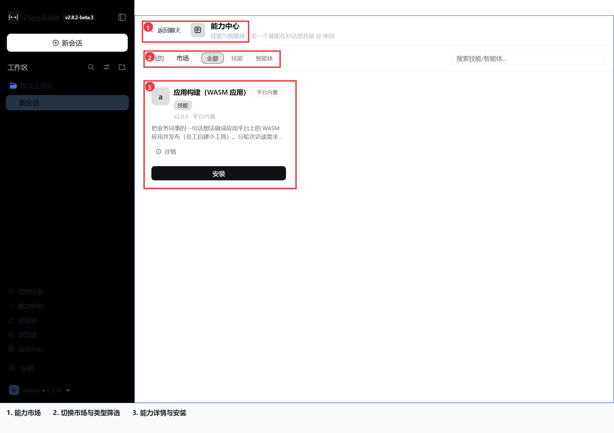

1. 切到 **① 市场**，按 **② 类型** 筛选或使用搜索框。
2. 在 **③ 能力卡片** 点“详情”，确认用途和来源后点“安装”。
3. 安装完成后到“我的”确认，再回到聊天中按能力说明调用。

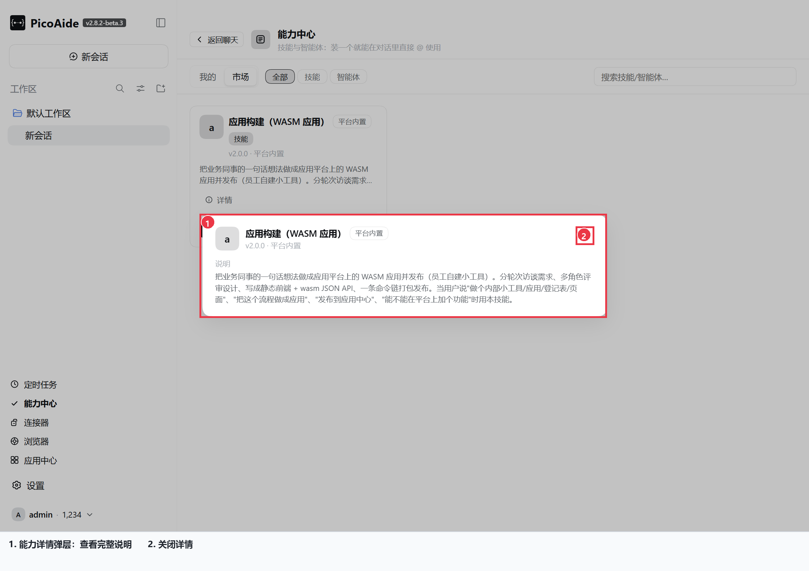

详情弹层显示卡片中被截断的完整说明；点右上角关闭按钮返回列表。

## 6. 连接器

连接器用于把授权的外部系统接入对话。点侧边栏“连接器”，通过搜索和状态筛选查找项目。演示截图没有获授权连接器，因此显示空态；实际可用项目由本单位管理员配置。

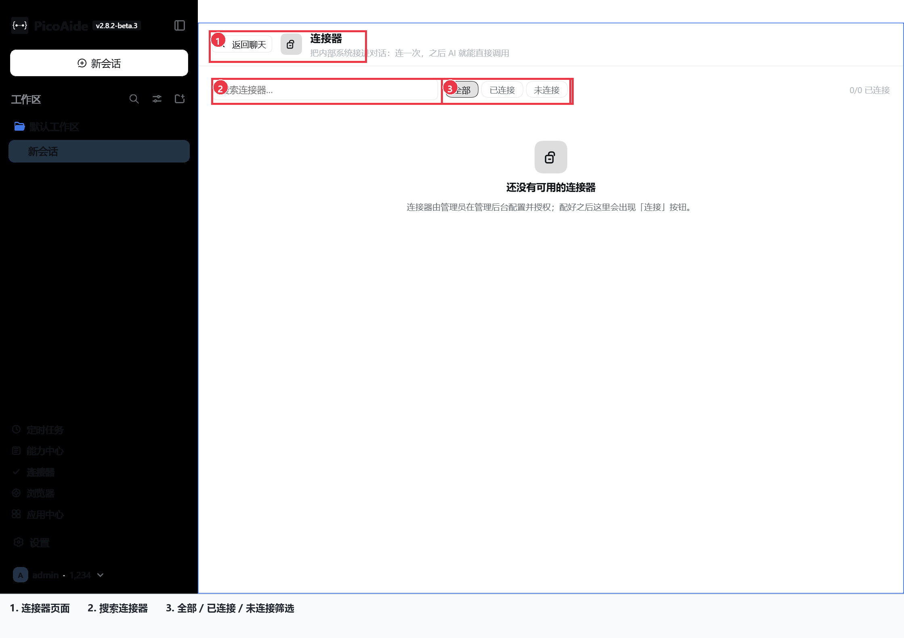

1. 在 **② 搜索框** 输入连接器名称；用 **③ 全部 / 已连接 / 未连接** 查看状态。
2. 若卡片出现“连接”按钮，点击并按提示完成授权；授权成功后会归入“已连接”。
3. 若页面显示“还没有可用的连接器”，联系本单位管理员开放对应项目。
4. 连接成功后再回聊天描述要查询或处理的业务数据。

## 7. 浏览器

侧边栏的“浏览器”用于打开客户端内置浏览器，在会话中查看网页或完成需要人工接管的页面操作。点左侧“浏览器”入口即可打开；它可能在独立窗口显示，仍属于客户端功能。

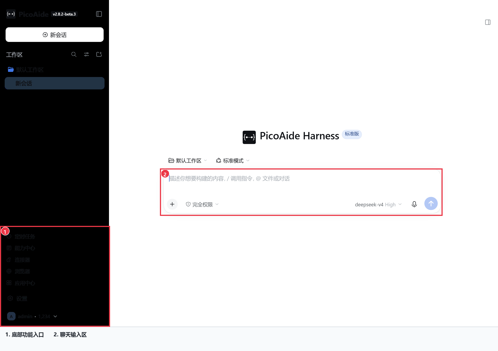

打开后，在浏览器窗口输入网址或切换标签；涉及登录、验证码和敏感提交时，由你在浏览器里亲自确认。上图标注的底部入口包含“浏览器”。

## 8. 应用中心

应用中心用于查找、打开和分享同事发布的小工具。点侧边栏“应用中心”；演示截图中的应用名称和负责人都是模拟数据。

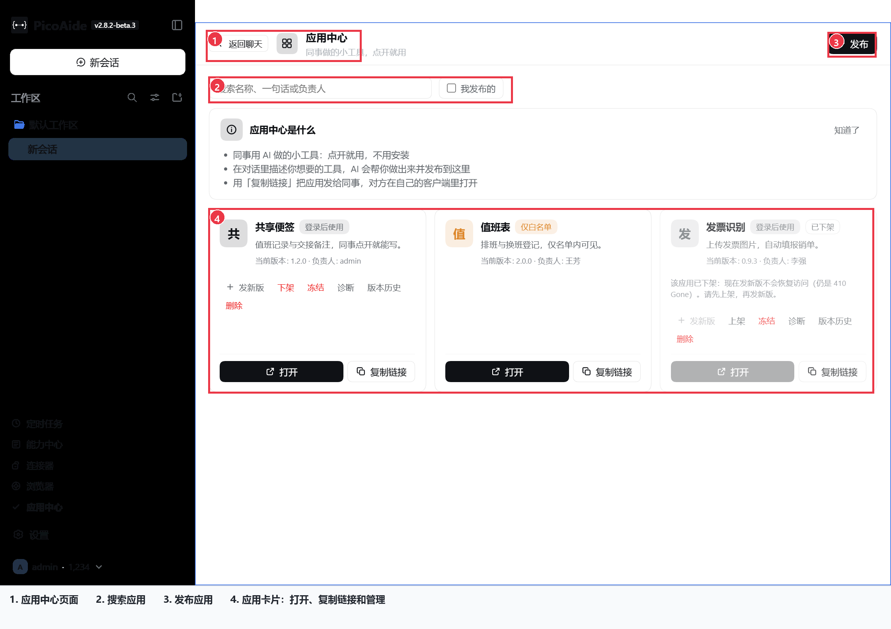

- **① 页面顶部**：点“返回聊天”回到会话。
- **② 搜索与“我发布的”**：按名称、描述或负责人查找；勾选后只看自己发布的应用。
- **③ 发布**：发布已有应用。也可以先在聊天中描述需要的小工具，再按创建结果进入发布流程。
- **④ 应用卡片**：点“打开”使用；点“复制链接”分享给同事。自己发布的项目还能管理版本、上下架或删除。灰色按钮表示当前项目不可打开。

## 9. 设置与外观

点侧边栏“设置”打开设置页。左侧选择“通用设置”“Agent 预设”“账号”“关于”等分类；右侧修改对应选项。修改会话行为前先看该选项是否只影响新会话。

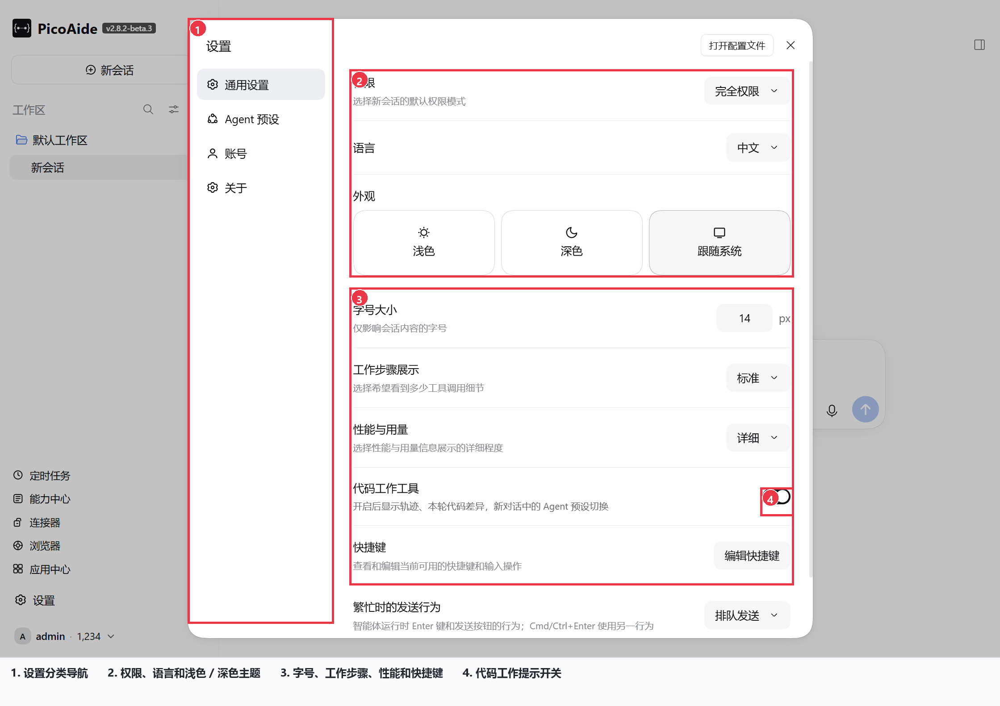

- **① 分类导航**：切换通用设置、Agent 预设、账号和关于页面。
- **② 权限、语言、外观**：设置新会话默认权限、界面语言，以及浅色、深色或跟随系统主题。
- **③ 显示与输入选项**：调整字号、工作步骤显示、性能与用量信息、快捷键和发送行为。右侧内容可滚动。
- **④ 代码工作工具开关**：控制相关工作提示是否显示。

“打开配置文件”面向需要编辑本机配置的用户；一般使用客户端不必改动该文件。主题切换后侧栏与会话区会同步变化。

## 10. 账号与 Token 用量

侧边栏左下角账号行显示当前账号和 Token 状态。点账号行展开浮层，可查看输入、输出及本月用量，刷新数据或退出登录。这里显示的是 Token 用量，不是账户金额或余额。

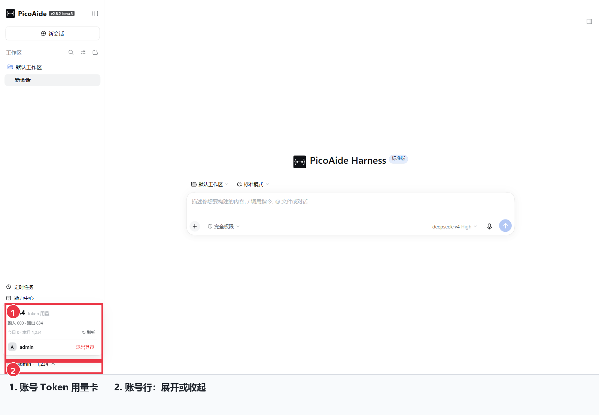

1. 点 **② 账号行** 展开或收起浮层。
2. 在 **① 用量卡** 查看输入、输出和本月统计；需要最新数据时点“刷新”。
3. 切换账号或离开共享电脑时点“退出登录”。

## 常见情况

| 情况 | 处理方法 |
| --- | --- |
| 登录页无法进入下一步 | 核对服务端地址是否完整、网络是否可达；向本单位管理员确认地址与登录方式。 |
| 找不到工作区文件 | 检查输入框上方选中的工作区；必要时重新添加本机目录。 |
| 连接器列表为空 | 该环境尚未开放连接器，联系本单位管理员。 |
| 市场里没有预期技能 | 检查“我的 / 市场”和类型筛选，搜索名称；仍没有时联系管理员。 |
| 定时任务没有运行 | 检查任务开关、计划时间与页面显示的 Host 时区，并查看执行详情。 |
| 应用按钮为灰色 | 查看卡片上的登录要求、上架状态或白名单说明。 |
| 右侧终端空白 | 当前 Windows 演示环境未验证终端内容渲染；先用系统终端操作。 |

---

截图仅用于说明客户端操作位置，模拟数据不代表真实单位配置。界面会随版本调整；若按钮名称不同，以当前客户端实际文字为准。
